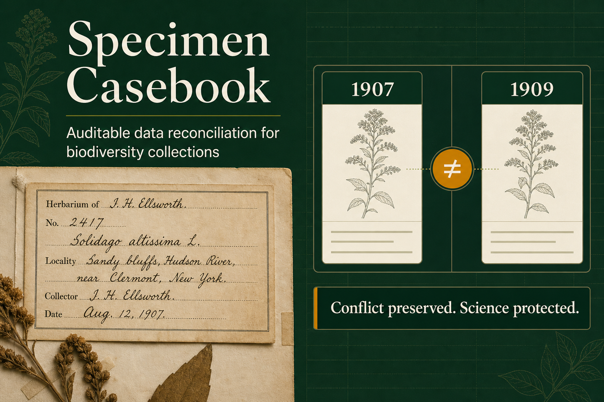
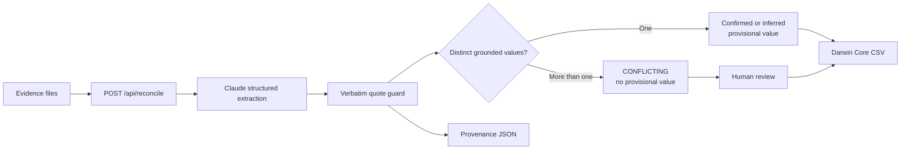

# Specimen Casebook

[](https://github.com/keigotak/specimen-casebook/actions/workflows/ci.yml)


**Auditable data reconciliation for biodiversity collections.**

Specimen Casebook helps herbarium collections data managers reconcile specimen labels, field ledgers, collector notebooks, taxonomy histories and legacy databases—without silently turning uncertainty into fact.



> **Claude proposes. The policy layer decides what can ship.**

## Judge shortcuts

| Review path | What it proves |
| --- | --- |
| [Five-minute judge's guide](docs/judges-guide.md) | Fastest route through the working code and adversarial test |
| [3-minute narrated demo](demo/SpecimenCasebook_3min_Demo.mp4) | Problem, user, product workflow and safety case |
| [How-to tutorial](docs/tutorial.md) | Step-by-step usage, how to read each status, and how to run your own evidence |
| [Synthetic evidence packs](demo/mock/) | Two inspectable cases: a date/locality conflict and a collector-identity conflict |
| [Claude integration](docs/claude-integration.md) | API contract, citation grounding, conflict policy and limitations |

The interface can be run locally without a key. Add `ANTHROPIC_API_KEY` only when exercising live Claude reconciliation; see [Run locally](#run-locally).

## The problem

Historical specimen evidence often disagrees. A label may say **June 17, 1907**, a field ledger may say **June 19, 1907**, and a legacy database may say **June 17, 1909**. Conventional digitization can flatten these claims into one value and discard the reasoning behind it.

Specimen Casebook keeps every field linked to its source, exposes the evidence state, and blocks unresolved conflicts from being published as settled facts.

> Without Specimen Casebook, 1909 could be published as fact. With it, the disagreement remains visible and reviewable.

## Named user

**Herbarium collections data manager**

> As a herbarium collections data manager, I want Claude to reconcile labels, ledgers and legacy records field by field, while preserving conflicts and source provenance, so that I can publish trustworthy biodiversity records without silently turning uncertainty into fact.

## Working architecture



### How Claude is used

1. **Source ingest** — the upload path accepts text, CSV, JSON, images and PDFs.
2. **Structured extraction** — `POST /api/reconcile` sends evidence to the Anthropic Messages API and requires strict JSON Schema output.
3. **Citation grounding** — each TXT, CSV or JSON quote is re-checked as an exact substring; altered or invented quotes are dropped.
4. **Deterministic reconciliation** — two distinct grounded values always become `CONFLICTING`, regardless of Claude's suggested status.
5. **Review and export** — the UI exposes every candidate and exports a Darwin Core CSV plus complete provenance JSON.

## Safety invariant

The primary metric is **unsupported resolution rate**: the share of conflicts collapsed into one answer without evidence. The application policy target is **0%**.

[`tests/reconcile-api.test.mjs`](tests/reconcile-api.test.mjs) deliberately makes the mocked model label three incompatible dates as `CONFIRMED` and invent one quote. The server still produces `CONFLICTING`, leaves the provisional value empty and drops the invented quote.

Additional evaluation metrics:

- seeded-conflict detection rate;
- field-to-source attribution accuracy;
- human-review triage accuracy;
- review time saved per specimen.

## Features

- Real Anthropic API integration with strict structured output
- TXT, CSV, JSON, image and PDF evidence upload
- Server-side textual citation-faithfulness guard
- Deterministic no-silent-resolution policy
- Source-linked candidate review
- Provisional chain-of-custody timeline
- Darwin Core CSV and provenance JSON export
- Responsive desktop and mobile interface

## Run locally

Prerequisite: Node.js 22.13 or newer.

```bash
npm ci
cp .env.example .env
# Set ANTHROPIC_API_KEY in .env
npm run dev
```

Verification:

```bash
npm run lint
npm test
```

The real model path requires `ANTHROPIC_API_KEY`. The API key stays server-side and must never be committed.

## Deploy to Cloudflare Workers

The repository uses a standard Workers build and does not depend on a platform-specific hosting wrapper.

```bash
npm run build
npx wrangler login
npx wrangler secret put ANTHROPIC_API_KEY --config dist/server/wrangler.json
npm run deploy
```

The generated Workers configuration serves the compiled client assets and the server-side reconciliation endpoint together.

## Repository map

```text
app/
  api/reconcile/       Claude request + deterministic policy guard
  live-reconciliation  Upload, review and export interface
demo/
  mock/                Synthetic inputs and expected reconciliation
  slides/              Rendered submission slides
  *.mp4 / *.pptx       Submission video and deck
docs/
  judges-guide.md      Five-minute verification route
  claude-integration.md API contract, guarantees and limitations
tests/
  reconcile-api.test.mjs Adversarial API and grounding tests
```

## Demo materials

- [Presentation deck](demo/SpecimenCasebook_Hackathon_Deck.pptx)
- [UI mock and synthetic case](demo/mock/README.md)
- [Narration and captions](demo/narration.json)
- [Reproducible video build](demo/render_video.py)

## Standards and event context

- [Darwin Core](https://dwc.tdwg.org/) is the biodiversity data-sharing standard targeted by the export workflow.
- Built for the **Build Track** of [Built with Claude: Life Sciences](https://cerebralvalley.ai/e/built-with-claude-life-sciences): start from a named life-sciences user and create working software that outlasts the hackathon.

## Scope

The herbarium case is synthetic demonstration evidence, not a real museum record. The upload path, Claude request, response schema, grounding checks, conflict policy, review UI, automated tests and export logic are working product code.

See [SECURITY.md](SECURITY.md) for key handling, upload limits, data-processing notes and known boundaries.

## License

Released under the [MIT License](LICENSE).
