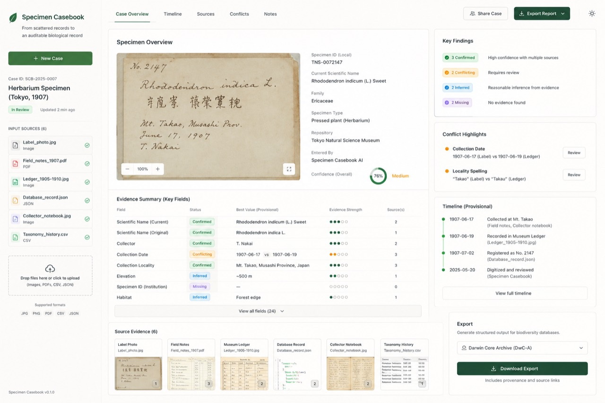

# Demo mock

This folder contains the visual mock and two synthetic evidence packs used to demonstrate Specimen Casebook. See the [how-to tutorial](../../docs/tutorial.md) for a full walkthrough.

## Case 1 — date & locality conflict (`SCB-2025-0007`)

This is the pack loaded by the **Load synthetic case** button. It intentionally contains disagreements across historical sources:

| Field | Specimen label | Field ledger | Legacy database |
| --- | --- | --- | --- |
| Collection date | 1907-06-17 | 1907-06-19 | 1909-06-17 |
| Locality | Mt. Takao | Mt. Takau | Mt. Takao |

Expected behavior:

- Preserve every candidate value and its source.
- Mark `collectionDate` and `verbatimLocality` as `CONFLICTING`.
- Do not publish either field without human review.
- Never silently select the legacy database value.

Start with [`case-scb-2025-0007/manifest.json`](case-scb-2025-0007/manifest.json).

## Case 2 — collector-identity conflict (`SCB-2025-0012`)

A second pack, [`case-scb-2025-0012-nikko-beetle/`](case-scb-2025-0012-nikko-beetle/), demonstrates a *different* kind of disagreement. Upload its five files via **＋ Add files** to try it.

| Field | Label / diary / card | Field ledger |
| --- | --- | --- |
| Recorded by | K. Yamada | K. Yamamoto |
| Collection date | 1934-08-05 | 1934-08-15 |

Expected behavior: `recordedBy` and `collectionDate` land `CONFLICTING`; the current scientific name resolves to the revised `Carabus (Ohomopterus) insulicola` while the original name is preserved; `Family` is `MISSING`. A live run against `claude-opus-4-8` also flags the catalog number (`5581` vs `TNS-I-0055581`) — additional real conflicts are fine; the invariant is only that none are silently resolved.

> This is synthetic demonstration data. Neither case is a real museum record, and must not be published as scientific data.
